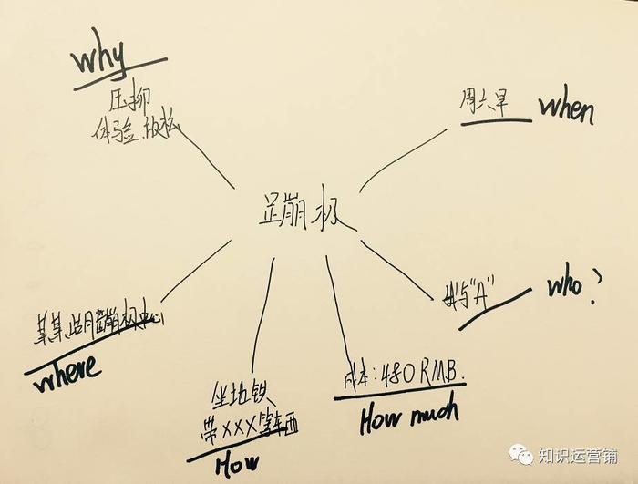
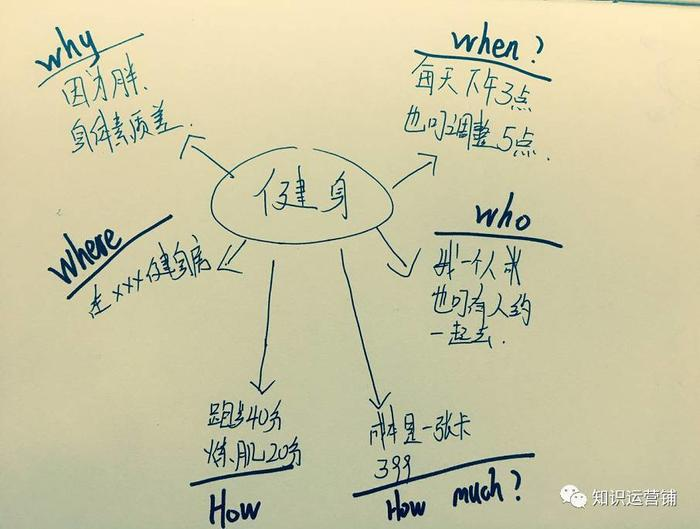
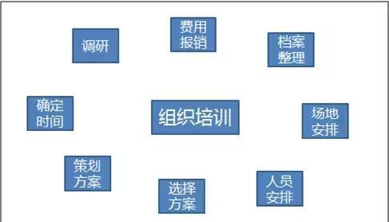
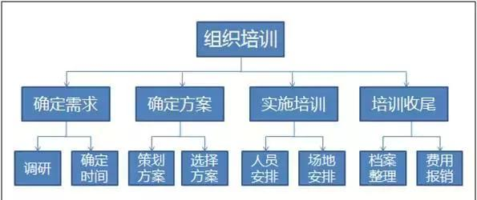
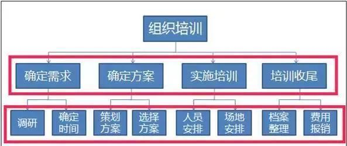

# 从逻辑思维角度提升自己的表达技巧

> 本文发表时间：2018 年 7 月 6 号
> 分类于[管理之道](../../index/manager.md)

## 逻辑性

从事软件开发行业的同学们或多或少都具有相当不错的逻辑性，毕竟编程开发本身就是逻辑性较强的任务。但是大家是否考虑过这种逻辑性应该怎么应用到社交技巧上？下面就跟着笔者一起来详细分析下吧。

## 逻辑思维

当逻辑性上升到软技能(社交技巧)层面，就成了逻辑思维。

逻辑思维一直是职场社交和个人职业发展中最重要的软技能之一。它的本质就是在遇到问题时，给你提供一种梳理问题、分析问题及解决问题的方法论。例如，当你需要向领导陈述问题时，你可以运用逻辑思维梳理即将表达的内容，把你的问题背景、论点及结论划分清晰，从而将你的结论层次清晰的传递过对方。

因此，你的逻辑思维能力越强，相对应的解决问题的能力及沟通技巧就越强。下面的内容，我们将从**问题描述、思考过程和沟通表达**三个角度对逻辑思维进行展开，问题描述不清楚甚至错误，那么思考过程就失去了意义；同时没有思考过程就没有合理的结论，没有合理的结论也就无法更好的进行沟通表达，因此这两点是逻辑思维的重中之重。

## 问题描述

描述问题的技巧主要为了解决以下的难点：

- 不能准确的界定问题。
- 对于问题不能进行较好的拆分
- 看待问题不全面

这里，首先我们引入**5W2H**的方法，该方法在管理学中会经常被提及，但是实际上，我们可以运用到个人决策方面，用来提升自身的问题分析和描述能力。

提出疑问对于发现问题和解决问题是极其重要的。创造力高的人，都具有擅于提问题的能力，众所周知，提出一个好的问题，就意味着问题解决了一半。提问题的技巧高，可以发挥人的想象力。相反，有些问题提出来，反而挫伤我们的想象力。

发明者在设计新产品时，常常提出：为什么（Why）；做什么（What）；何人做（Who）；何时（When）；何地（Where）；如何（How ）；多少（How much）。这就构成了 5W2H 法的总框架。如果提问题中常有"假如……"、“如果……”、“是否……”这样的虚构，就是一种设问，设问需要更高的想象力。

#### 一个简单的例子

其实缺乏 5W2H 导致了问题的场景在生活中是比比皆是的

> A: 老同学，今天遇到你很高兴啊，下次咱们一起去吃饭，聊一聊
> B: 好啊
> A: 88
> B: (黑人问号)心理状态：什么时候去啊？去哪里？AA？
> B: 得出结论： 看来是随便说说的，并不是真的想去

因此回答这一小节开头的难点，我们来简单分析下。

#### 不能准确的界定问题

如果是这一条的话，以后就用这个方法来思考问题。人的首要思维都是靠大脑在动，其实殊不知，很多事情用手和脑同时动，智商会被拉高的，而且思维会很活跃。所以请记下这个方法，在以后思考问题界定问题的时候，就用笔画下这个 5W2H，然后一一的去对入。时间久后，自然而然的锻炼除了大脑和手共同 “ 思考 ”，从而拉升智商的提高。

#### 看待问题不全面

## 思考过程

有了良好的问题描述，我们就可以开始更加深入的思考了，其实在描述问题的过程中，本身就进行了初步的思考了，不是吗？(回答不是的同学，请继续看上一节 ;( )

#### 对问题进行更进一步的明确

明确问题主要有两个方法：

1.  设定想要的状态，即设定目标或设定参照物。当问题很明确，那么设定“理所当然”的目标即可，如：公司连续两年赤字，那么设定目标为公司盈利即可；当问题不明确，那么需要设定理想目标，如：公司连续 10 年保持全国第四，那么设定目标可考虑 5 年内成为全国第一。
2.  把问题具体化到能够思考原因的大小，列举具体事例，从事例中归纳问题。如，年轻员工没有朝气，那么我们可以通过列举具体事例：打招呼有气无力、写资料错误率高、辞职率高等，通过这样的细化，我们就知道具体的问题是什么了。

#### 深挖原因

深挖原因的关键在于，不停地询问为什么，逐步深入挖掘。如何有逻辑地深入挖掘原因？这里建议使用**MECE 分析法**。下面会介绍 MECE，但是**大家要注意**： 不是所有问题都是严格的按照 MECE 的方法来执行，大家可以在学习后，自己总结一套简化版本，适用于日常情况的，生搬硬套总是会落入下乘的。

##### MECE 分析法

该方法是麦肯锡的黄金法则：四步看透问题的本质，精准解决问题!

MECE，是 Mutually Exclusive Collectively Exhaustive 缩写，中文意思是"相互独立，完全穷尽"。 也就是对于一个重大的议题，能够做到不重叠、不遗漏的分类，而且能够借此有效把握问题的核心，并解决问题的方法。

所谓的不遗漏、不重叠指在将某个整体（不论是客观存在的还是概念性的整体）划分为不同的部分时，必须保证划分后的各部分符合以下要求：

- 完整性（无遗漏），指分解工作的过程中不要漏掉某项，意味着问题的细分是在同一维度上并有明确区分、不可重迭的
- 独立性（无重复），强调每项工作之间要独立，无交叉重叠，意味着问题的分析要全面、周密

##### 一个例子

工厂里搞 5S 管理时候培训师经常使用的一个例子，“怎么整理三个抽屉里的杂乱东西”:

###### 方法一

1.  抽屉一的东西分类，整理
2.  抽屉二的东西分类，整理
3.  抽屉三的东西分类，整理

###### 方法二

1.  定义三个类别，三个抽屉分别规定一个类别
2.  整理抽屉一到一二三
3.  整理抽屉二到一二三
4.  整理抽屉三到一二三

###### 方法三：

1.  所有东西都拿出来
2.  规定三个抽屉内物品的用途
3.  所有的物品按照类别放进去

> 我们来评价一下三种方法：
> 方法一，程序最复杂，需要至少九个步骤，且结果最差，整理后东西仍然是混乱的，按照 5S 的定义只涉及到整理没涉及到整顿;
> 方法二，程序复杂，九个步骤，结果是清晰的;
> 方法三，步骤简单，结果清晰

#### MECE 的四个步骤

##### 确定范围。

也就是要明确当下讨论的问题到底是什么，以及我们想要达到的目的是什么。这个范围决定了问题的边界。这也让”完全穷尽“成为一种可能。换句话说，MECE 中的”完全穷尽“是指有边界的穷尽。

##### 寻找符合 MECE 的切入点。

所谓的切入点是指，你准备按什么来分，或者说大家共同的属性是什么。比如，是按颜色分、按大小分、按时间序列分还是按重要性分？这一步是最难的，但也是最关键的。在找切入点的时候，一定要记得以终为始！这个时候一定要反复思考，你当初要解决的【问题】或当初分析的【目的】是什么。换句话说，你希望分类后解决什么问题，得出什么结论。

##### 找出大的分类后考虑是否可以用 MECE 继续细分。

当你觉得这些内容已经确定以后，仔细琢磨它们。是不是每一项内容都是独立的、可以清楚区分的事情？如果是，那么你的内容清单就是"相互独立的"。如果不是，对它们进行分类和归纳。

##### 确认有没有遗漏或重复。

分完类之后必须重新检视一遍，看看有没有明显的遗漏或重复。建议画出一个金字塔结构图，用可视化的方式比较容易发现是否有重叠项。

##### 注意事项

1.  在确立问题的时候，通过类似鱼刺图的方法，在确立主要问题的基础上，再逐个往下层层分解，直至所有的疑问都找到，通过问题的层层分解，可以分析出关键问题和初步的解决问题的思路；
2.  结合头脑风暴法找到主要问题，然后在不考虑现有资源的限制基础上，考虑解决该问题的所有可能方法，在这个过程中，要特别注意多种方法的结合有可能是个新的解决方法，然后再往下分析，每种解决方法所需要的各种资源，并通过分析比较，从上述多种方案中找到目前状况下最现实最令人满意的答案。

#### 一个案例: 如何组织一场培训

###### 确立核心问题

###### 列出关键点，并且完全穷尽

###### 检查每一项是否完全独立，如果不是，对它们进行分类和归纳

###### 再检查是否每一层是否完全独立，而且穷尽

#### MECE 总结

我们会发现这种呈现的结构变成了金字塔样式，每一层都是下一层内容的总结概括，而第一层是要阐述的核心问题（或观点），这就是麦肯锡推崇的金字塔思维结构。使用金字塔结构图可以比较容易地发现是否有重叠项。

MECE 原则最大好处就在于，对于影响问题产生的所有因素进行层层分解，通过分解得出关键问题所在，以及解决问题的初步思路。无论绩效问题还是业绩问题，都可以通过 MECE 不断归纳总结，梳理思路寻找达到目标的关键点。

## 沟通表达

在问题被描述、思考清楚后，就该沟通表达了，可以遵循**论点** -> **结论** -> **理由** -> **行动**的框架。

#### 论点/背景

论点，一般指接下来谈话的中心内容。论点阐述时经常包含背景介绍，它们往往不可分割，阐述论点，应尽量从对方了解的信息开始阐述。

我们可以使用上本提到的 5W2H 法来细化论点，同时将来各事件元素(时间、地点、人物、事件、原因、如何进展、进展如何等)梳理清楚。

举一个简单例子，你想找领导聊聊加班的事情，你不能说 “Boss，关于加班我想找你聊一聊“ 。这样显然没有将事件元素陈述清晰，Boss 会无法判断你谈话的内容，他只能去猜测你将要表达内容是关于加班的哪个方面。正确的论点阐述应该是 “Boss,最近，年轻员工加班时间增加过多了，导致了大家怨言较多，人心浮动，我们是不是应该做一些调整？”, 这样论点就描述清楚了。

#### 结论

1.  不要答非所问
    结论和论点要紧密相关，这样易于被听众快速理解接。如果问题是“是/否”类型，那就以是否作为结论开始；如果问题是怎么做，那就回答该怎么做，尽量避免答案过于弯绕。

例如，领导问你最近你的工作完成的如何？你回答说“还在进行中”，其实就不太合理，领导既然这么问，也许是抱着以下目的的：

- 阶段性的结果是什么
- 是否存在一些困难
- 也许你平时跟领导汇报太少了，所以他对你的状态是不清楚的
- 对你的关心

结果，你仅仅是一句“还在进行中”，基本没有给领导提供任何可用的信息。

2.  遵循金字塔原则：结论先行
    否则倾听者容易产生疲倦。当希望给倾听者以准备时间或者倾听者自行得出结论的时候，我们才将结论放后面。

3.  理由
    理由的陈述关键点在于前文提到的**MECE 分析法**, 筛选“合格”理由作为结论的支撑，避免将一个相似的理由分成多个理由来说。那么如何做到符合 MECE 原则？如何筛选“正确合格”理由？

- 换位思考
  从对方角度设想，选择能让对方信服的理由，所以面对不同的听众，要有不同的侧重
- 理由的理由
  对于认同感不强的理由，采用“理由的理由”去支持它。“理由的理由”可以是：数据证明、一般常识/规律、事例的累积、已决断的策略、公司规定/制度等
- 理由推导结论
  有大量事实，但没有结论的场景，我们可以先陈列大量理由，从理由中推导出结论
- 理由整理分类
  已经有结论，但理由支撑没有思路的时候，我们同样可以先陈列大量理由，再整理分类理由

**在目前互联网行业，有一个很好的结论阐述法：基于数据的结论。因此大家在给予结论时，首先给出基于理由推导出的结论，其次应该尽量用数据来佐证你的结论，提高说服力。**

> 最后我们再介绍一种科学的由理由推导结论的方法：

1.  归纳并举：列举理由，通过理由的共通点推测结论，这种推理方式的缺点是显得主观，所以要格外注意考虑例外的情况
2.  演绎推理型：三段式，"大前提 + 小前提" -> 结论。如果大前提、小前提是错误的，那么演绎推理的结论也是无意义的，所以要注意确保大、小前提是正确的

## 最后

给大家推荐一本书<<零秒思考>>,推荐一篇文章[<<使用 A4 纸笔记法 100 天增强逻辑思维>>](https://mp.weixin.qq.com/mp/appmsg/show?__biz=MjM5NjA3OTM0MA%3D%3D&appmsgid=203182672&itemidx=1&sign=595c3d2fe1233a441011b9d8e696a083#rd&uin=MjU4MjUyNzM2MA%3D%3D&key=79cf83ea5128c3e59a05178691cc0d51487d45a3b3704ccaa2340ff568d898b089e6e31cf75c6a261042289e859b66c0&devicetype=android-10&version=25000338&lang=zh_CN&pass_ticket=1V0MbhKBMhjP%2BE4eiEonppyltegkgcZRy%2F%2FCxeKJlauehqow4jLPOnbhMpyI0xCB#wechat_webview_type=1#wechat_redirect&From=test)

理论懂得再多，如果不实践，那就是纸上谈兵，希望大家最终都能通过实践形成强大的逻辑思维，为未来的成功之路打下坚实的基础。
